# Mammography-MTL


Multi-task Deep Learning for Simultaneous Breast Lesion Type and Pathology Classification using Mammography Images

A PyTorch-based multi-task learning framework for automated mammography analysis on the **CBIS-DDSM** dataset.

The model predicts two clinically relevant tasks from a single mammography image:

- **Lesion Type**: Calcification vs Mass
- **Pathology**: Benign vs Malignant

---

# Overview

<p align="center">
  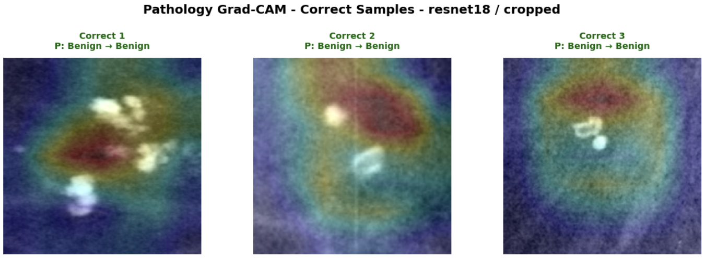
</p>

<p align="center">
  <em>Grad-CAM visualization highlighting image regions that contribute to pathology prediction.</em>
</p>

Mammography-MTL is a multi-task deep learning framework designed for breast cancer image analysis using mammography images.

Instead of training separate models for lesion type classification and pathology classification, this project uses a shared CNN backbone with two task-specific classification heads. The shared representation allows the model to learn mammographic features that are useful for both tasks in a single forward pass.

The framework supports training and evaluation across multiple pretrained CNN backbones, generates publication-style evaluation figures, and provides Grad-CAM explainability for visual interpretation of model predictions.

---

# Key Features

- Multi-task learning for mammography image classification
- Simultaneous lesion type and pathology prediction
- Shared CNN backbone with dual classification heads
- Transfer learning using pretrained CNN architectures
- Support for multiple backbone models:
  - ResNet18
  - DenseNet121
  - EfficientNet-B0
  - MobileNetV3-Small
- Class-balanced loss for imbalanced labels
- Stratified train / validation / test splitting
- Automatic experiment comparison
- ROC and Precision-Recall analysis
- Confusion matrix visualization
- Sample prediction visualization
- Grad-CAM explainability
- Automatic checkpoint and metadata generation
- Clean modular PyTorch project structure

  ---

# Dataset

This project uses the publicly available **CBIS-DDSM (Curated Breast Imaging Subset of DDSM)** dataset.

CBIS-DDSM is one of the most widely used benchmark datasets for computer-aided breast cancer diagnosis from mammography images.

The dataset contains two major lesion categories:

- Calcification
- Mass

Each case is annotated with:

- Lesion category
- Pathology label
- ROI information
- Cropped lesion images
- Original mammography images

In this project, only the **cropped lesion images** are used as model inputs.

> Dataset ownership, licensing, and citation requirements belong to the original CBIS-DDSM authors.

---

# Multi-Task Learning Objective

Unlike conventional single-task classifiers, the proposed framework jointly learns two related prediction tasks from a shared feature representation.

The network simultaneously predicts:

## Task 1 — Lesion Type Classification

Binary classification:

- Calcification
- Mass

---

## Task 2 — Pathology Classification

Binary classification:

- Benign
- Malignant

Both tasks are optimized simultaneously during training using a shared backbone and two independent classification heads.

---

# Why Multi-Task Learning?

Lesion morphology and pathological characteristics are highly correlated.

Instead of learning each task independently, a shared encoder allows both tasks to benefit from common mammographic features, improving feature reuse and reducing model redundancy.

Compared with training two separate CNN models, the proposed framework:

- learns richer shared representations
- reduces computational cost
- decreases model size
- performs both predictions in a single forward pass

---

# Project Structure

```text
Mammography-MTL
│
├── assets/
│   └── results/
│
├── checkpoints/
│
├── configs/
│   └── config.py
│
├── data/
│   ├── dataset.py
│   ├── prepare_data.py
│   └── transforms.py
│
├── models/
│   ├── model.py
│   └── gradcam.py
│
├── src/
│   ├── train.py
│   ├── evaluate.py
│   ├── metrics.py
│   ├── utils.py
│   └── visualize.py
│
├── outputs/
│
├── main.py
├── requirements.txt
├── LICENSE
└── README.md
```

The repository follows a modular design to simplify experimentation, maintenance, and future extension.

---

# Data Preparation

The preprocessing pipeline automatically prepares the CBIS-DDSM dataset before training.

The workflow includes:

- Loading mass and calcification metadata files
- Merging training and test metadata
- Assigning lesion labels
- Encoding pathology labels
- Building a unique image index from the JPEG directory
- Resolving image paths from CSV metadata
- Removing incomplete or missing samples
- Stratified train/validation split using both prediction tasks
- Automatic DataLoader generation

The dataset is shuffled using a fixed random seed to ensure reproducibility.

---

# Image Preprocessing

Each cropped mammography image undergoes the following preprocessing steps before being fed into the network:

- Loading grayscale mammography images
- Resizing to **224 × 224**
- Converting grayscale images to three RGB channels
- Tensor conversion
- Intensity normalization

Only cropped lesion images are used throughout the experiments.

---

# Data Augmentation

Training images are augmented online to improve model generalization.

The augmentation pipeline includes:

- Random Resized Crop
- Random Horizontal Flip
- Random Rotation
- Random Affine Translation
- Brightness Adjustment
- Contrast Adjustment
- Image Normalization

Validation and test images are processed using deterministic resizing and normalization only.

---

# Handling Class Imbalance

Both prediction tasks exhibit class imbalance.

To reduce bias toward majority classes, weighted cross-entropy loss is employed independently for each task.

Class weights are automatically computed from the training set using:

- inverse class frequency
- balanced class weighting

This allows the network to assign greater importance to underrepresented classes during optimization.

---

# Training Configuration

The default experimental setup is:

| Parameter | Value |
|-----------|------:|
| Image Size | 224 × 224 |
| Batch Size | 16 |
| Epochs | 10 |
| Optimizer | AdamW |
| Learning Rate | 1e-4 |
| Weight Decay | 1e-4 |
| Early Stopping | 5 epochs |
| Random Seed | 42 |

The framework automatically detects and utilizes CUDA when available.

---

# Model Architecture

The proposed framework follows a multi-task learning paradigm in which a single CNN backbone extracts shared visual representations that are simultaneously used for two independent classification tasks.

Rather than training separate models for lesion type and pathology prediction, both tasks share the same feature extractor while maintaining task-specific output layers.

This design improves feature reuse, reduces computational complexity, and enables simultaneous prediction in a single forward pass.

## Supported Backbone Networks

The framework currently supports four ImageNet-pretrained CNN architectures:

- ResNet18
- DenseNet121
- EfficientNet-B0
- MobileNetV3-Small

The backbone can be selected through the project configuration without modifying the training pipeline.

---

## Architecture

```text
Input Mammography Image (224 × 224 × 3)
                 │
                 ▼
     Pretrained CNN Backbone
      (Shared Feature Extractor)
                 │
                 ▼
        Shared Feature Vector
                 │
        ┌────────┴────────┐
        │                 │
        ▼                 ▼
 Lesion Classification   Pathology Classification
        Head                    Head
        │                        │
        ▼                        ▼
 Calcification / Mass     Benign / Malignant
```

Both prediction heads are optimized jointly during training while sharing the same backbone representation.

---

## Classification Heads

Each task uses an independent classification head consisting of:

- Dropout layer
- Fully Connected layer
- Softmax prediction

This separation allows each task to specialize while benefiting from shared visual features learned by the backbone.

---

# Loss Function

Training is performed using a weighted multi-task objective.

The total loss is defined as:

```text
Ltotal = λ₁ × Llesion + λ₂ × Lpathology
```

where:

- **Llesion** is the weighted cross-entropy loss for lesion type classification.
- **Lpathology** is the weighted cross-entropy loss for pathology classification.
- λ₁ = 1.0
- λ₂ = 1.0

Class weights are automatically computed from the training data to compensate for class imbalance.

---

# Training Strategy

The training pipeline includes:

- Transfer learning from ImageNet-pretrained models
- AdamW optimization
- Learning rate scheduling using ReduceLROnPlateau
- Early stopping based on validation performance
- Automatic best-model checkpoint saving
- Validation after every epoch
- Automatic experiment comparison across all backbone networks

The best model is selected using a combined validation score computed from both classification tasks.

---

# Evaluation Metrics

The proposed framework is evaluated independently on both classification tasks using a comprehensive set of performance metrics.

## Lesion Classification

The following metrics are reported:

- Accuracy
- Balanced Accuracy
- Precision
- Sensitivity (Recall)
- Specificity
- F1-score
- Matthews Correlation Coefficient (MCC)
- ROC-AUC
- Average Precision (AP)

---

## Pathology Classification

The same evaluation protocol is adopted for pathology prediction:

- Accuracy
- Balanced Accuracy
- Precision
- Sensitivity (Recall)
- Specificity
- F1-score
- Matthews Correlation Coefficient (MCC)
- ROC-AUC
- Average Precision (AP)

---

## Overall Multi-task Score

To compare different backbone architectures fairly, a combined multi-task score is computed by aggregating the performance of both prediction tasks.

This score is used for model selection during validation and for ranking the final experimental results.

---

# Experimental Results

Four ImageNet-pretrained CNN backbones were evaluated under the same experimental protocol.

The comparison includes:

- ResNet18
- EfficientNet-B0
- DenseNet121
- MobileNetV3-Small

All models were trained using identical preprocessing, optimization strategy, and evaluation protocol to ensure a fair comparison.

Among the evaluated architectures, **ResNet18** achieved the highest overall multi-task performance and was selected as the final model.

### Best Performing Model

| Backbone | Input | Combined Score |
|-----------|-------|---------------:|
| **ResNet18** | Cropped | **0.8256** |

---

## Best Model Performance

### Lesion Classification

| Metric | Score |
|---------|------:|
| Accuracy | **89.63%** |
| F1-score | **90.15%** |
| ROC-AUC | **96.51%** |

### Pathology Classification

| Metric | Score |
|---------|------:|
| Accuracy | **73.30%** |
| F1-score | **66.55%** |
| ROC-AUC | **79.24%** |

Training Time (ResNet18): **6.19 minutes**

---

# Backbone Comparison

The proposed framework was evaluated using four different ImageNet-pretrained CNN backbones under identical experimental settings.

The comparison demonstrates that while all architectures achieve strong lesion classification performance, their ability to jointly optimize both lesion type and pathology prediction differs.

Overall, **ResNet18** achieved the highest combined multi-task score, providing the best trade-off between the two prediction tasks.

---

## Combined Multi-task Score

<p align="center">
  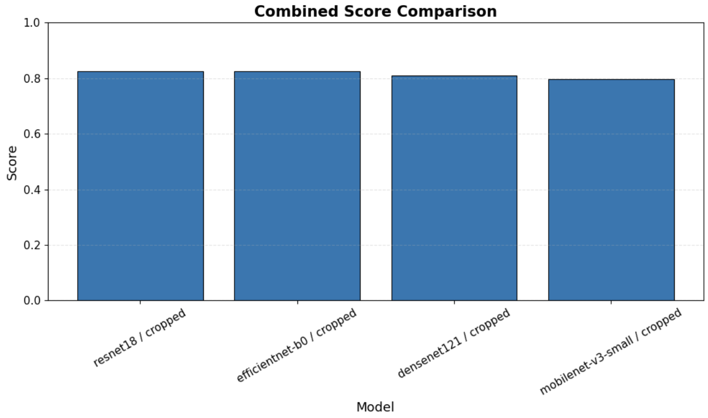
</p>

*Comparison of the overall multi-task score across all evaluated backbone networks.*

---

## Lesion Classification Accuracy

<p align="center">
  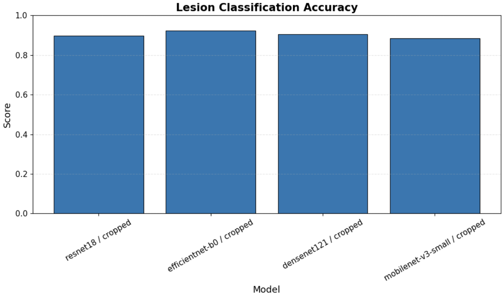
</p>

*Comparison of lesion type classification accuracy for all backbone architectures.*

---

## Pathology Classification Accuracy

<p align="center">
  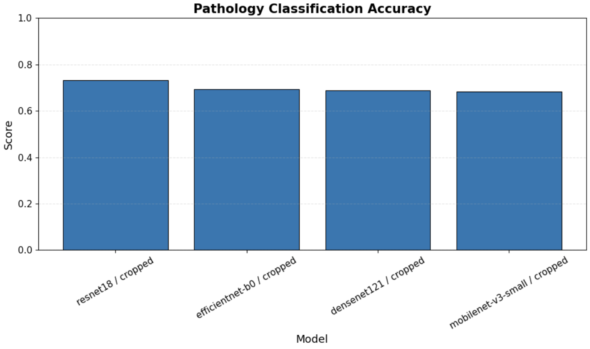
</p>

*Comparison of pathology classification accuracy for all evaluated models.*

---

# Visualization

The framework provides multiple visualization utilities for interpreting model predictions and comparing experimental results.

These visualizations include prediction examples, confusion matrices, ROC curves, Precision–Recall curves, and Grad-CAM activation maps.

---

## Sample Multi-task Predictions

The following examples illustrate correct and incorrect predictions produced by the best-performing model (ResNet18).

Each sample simultaneously reports:

- Lesion type prediction
- Pathology prediction

Green titles indicate correct predictions, while red titles indicate misclassified samples.

<p align="center">
  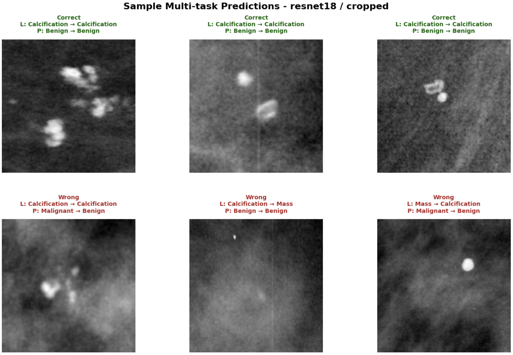
</p>

*Example predictions generated by the proposed multi-task framework.*

---

## Confusion Matrices

Confusion matrices provide a detailed analysis of classification performance by illustrating correctly classified samples and common sources of error.

### Lesion Classification

<p align="center">
  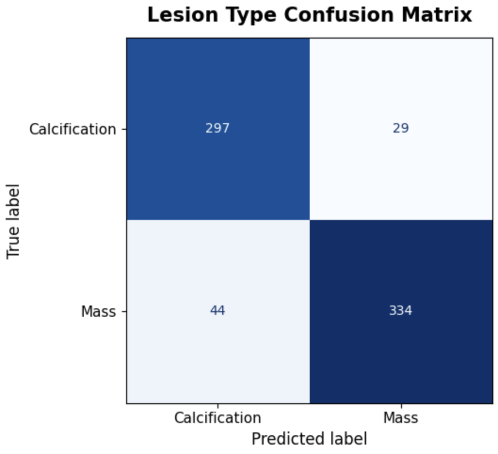
</p>

*Confusion matrix for lesion type classification.*

---

### Pathology Classification

<p align="center">
  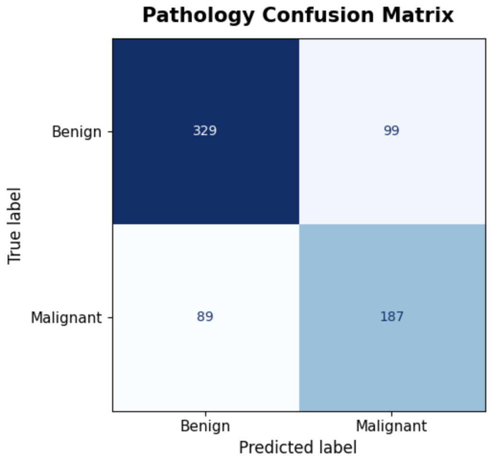
</p>

*Confusion matrix for pathology classification.*

---

## ROC Curves

Receiver Operating Characteristic (ROC) curves illustrate the trade-off between sensitivity and specificity.

Higher AUC values indicate stronger discriminative capability.

### Lesion Classification

<p align="center">
  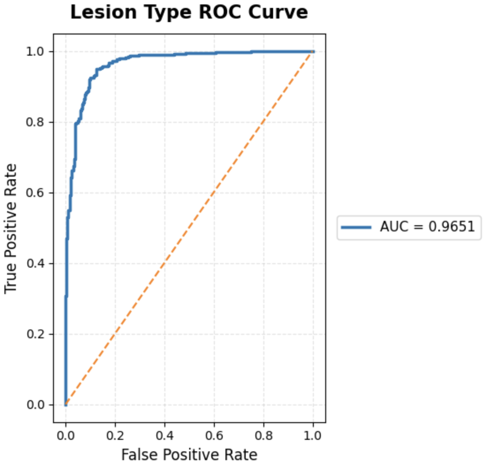
</p>

---

### Pathology Classification

<p align="center">
  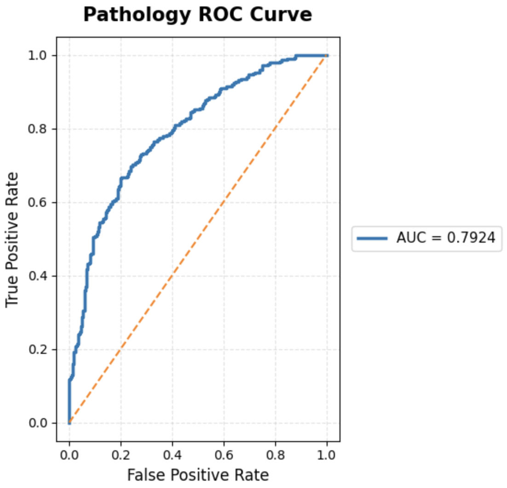
</p>

---

### Lesion Backbone Comparison

<p align="center">
  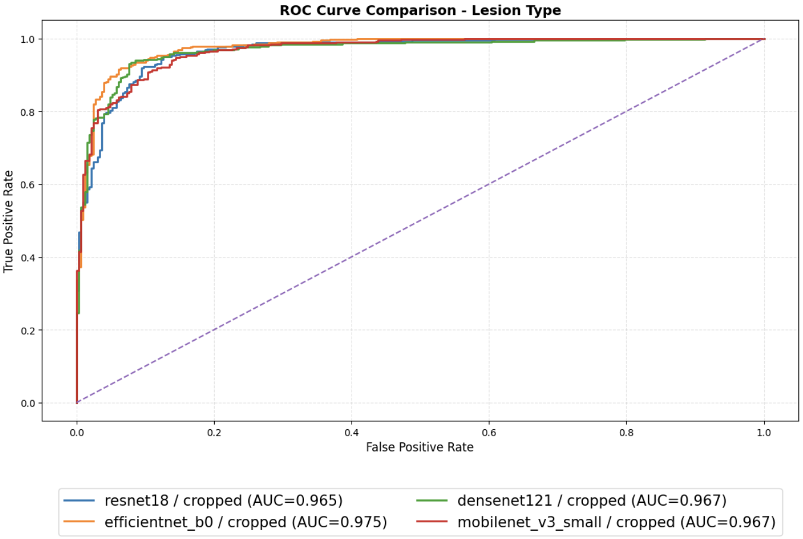
</p>

---

### Pathology Backbone Comparison

<p align="center">
  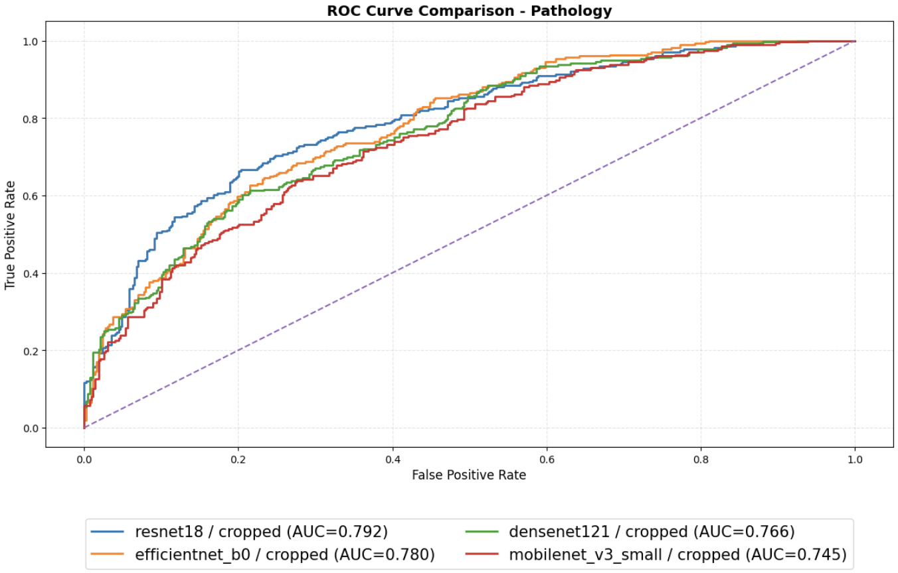
</p>

---

## Precision–Recall Curves

Precision–Recall (PR) curves provide additional insight into model performance, particularly for imbalanced classification problems.

Average Precision (AP) summarizes the area under each PR curve and complements ROC-AUC by emphasizing the trade-off between precision and recall.

### Lesion Classification

<p align="center">
  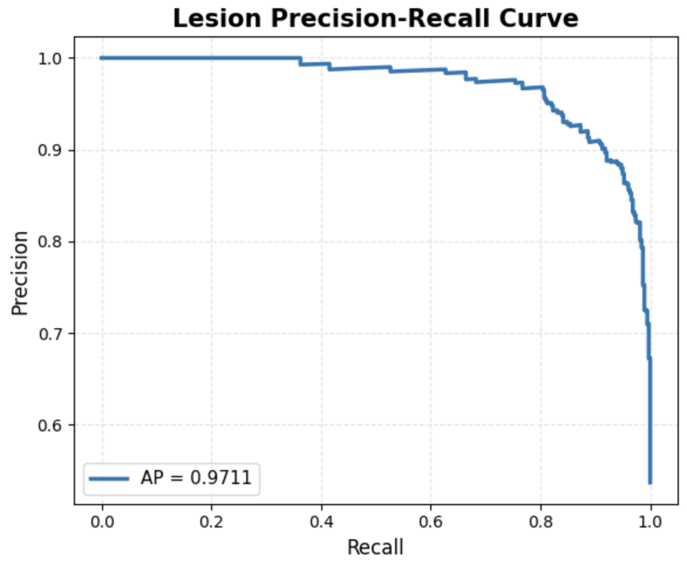
</p>

---

### Pathology Classification

<p align="center">
  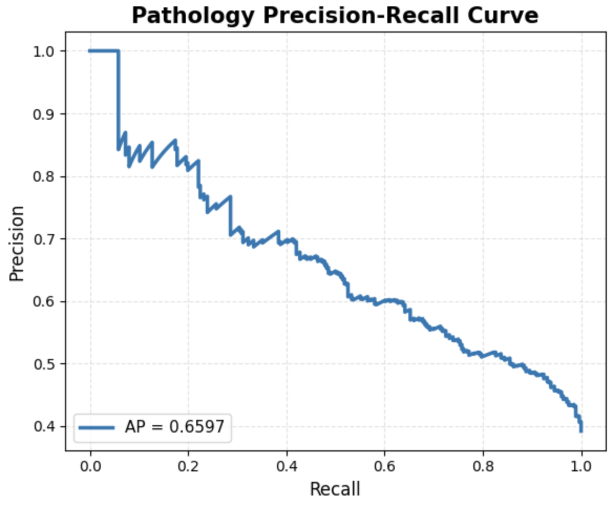
</p>

*Precision–Recall curves obtained using the best-performing multi-task model.*

---

# Grad-CAM Explainability

Understanding **why** a deep learning model makes a particular prediction is as important as the prediction itself.

To improve interpretability, Grad-CAM (Gradient-weighted Class Activation Mapping) is applied to the best-performing model.

Grad-CAM highlights the image regions that contribute most strongly to the network's decision, allowing visual inspection of whether the model focuses on clinically meaningful lesion regions.

<p align="center">
  
</p>

<p align="center">
  <em>Grad-CAM visualization for correctly classified pathology samples.</em>
</p>

The visualization demonstrates that the model primarily attends to lesion regions rather than surrounding background tissue, providing additional confidence in the learned representations.

---

# Installation

Clone the repository:

```bash
git clone https://github.com/SarvinChitsaz/Mammography-MTL.git

cd Mammography-MTL
```

Install the required packages:

```bash
pip install -r requirements.txt
```

---

# Requirements

The project was developed using:

```text
Python >= 3.10
PyTorch
Torchvision
NumPy
Pandas
OpenCV
Matplotlib
Scikit-learn
Pillow
tqdm
```

CUDA is automatically used when available.

---

# Running the Project

Run the complete experimental pipeline:

```bash
python main.py
```

The pipeline automatically performs:

- Dataset preparation
- Data augmentation
- Model construction
- Multi-task training
- Validation
- Testing
- Metric computation
- Figure generation
- Best model selection
- Checkpoint saving

No additional scripts are required.

---

# Project Outputs

After training, the repository automatically generates:

- Trained model checkpoints
- Performance summaries
- Confusion matrices
- ROC curves
- Precision–Recall curves
- Backbone comparison plots
- Sample predictions
- Grad-CAM visualizations
- Complete experiment metadata

Generated files are stored inside the `outputs/` directory.

---

# Future Work

Potential future improvements include:

- Support for Vision Transformer (ViT) backbones
- Integration of ConvNeXt and Swin Transformer architectures
- Multi-label breast abnormality prediction
- External validation on additional mammography datasets
- Automatic hyperparameter optimization
- DICOM image support
- Clinical decision-support integration
- Explainability using Grad-CAM++, Score-CAM, and Eigen-CAM
- Deployment as a web-based inference application

  ---

# License

This project is released under the MIT License.

See the LICENSE file for additional details.
